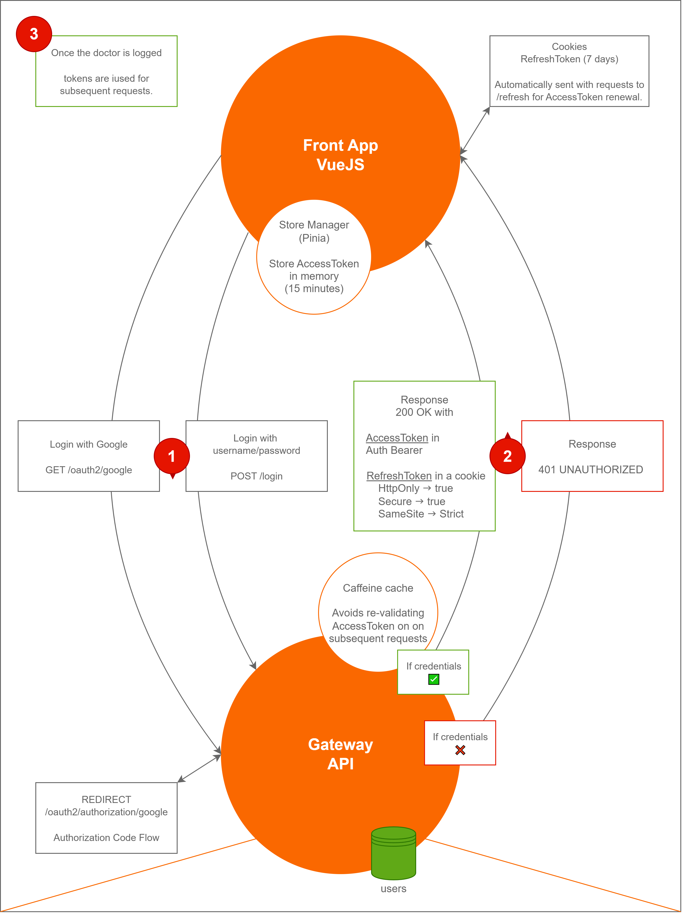

``MediLabo Solutions - Diabetes risk assessment

Microservices application for diabetes risk assessment built with Spring Boot and Vue.js.

🔍 [Performance analysis](_doc/performance-analysis.md) — the main performance bottleneck was the system resource contention caused by running the app, monitoring, and load tests on the same machine — not the application itself.

📄 [Documentation & Reports](https://mr-boubakour.github.io/-BOUBAKOUR-MohamedRedha-p9-MicroServices-spring/) — includes **Javadoc** and **JaCoCo reports** for the microservices where documentation and test coverage bring the most value.

---

### 🏗️ Architecture

Architecture details (click to expand)

- **Microservices architecture**, each service owning a clear business responsibility.
- **Single page application** built with Vue.js 3, communicating securely with the API gateway.
- **Reactive API gateway** centralizes routing, authentication, and authorization.
- **Service discovery** via Eureka enables dynamic routing and scalability.
- **Synchronous** REST for standard service communication; **asynchronous** messaging via RabbitMQ for critical events.
- **Core business services**:
  - Patients service — manages patient records with relational storage.
  - Notes service — handles medical notes using a NoSQL store.
  - Assessments service — evaluates diabetes risk, detects risk level changes, and emits high-risk events.
  - Notifications service — consumes events and sends alert emails to healthcare professionals.
- **Integrated observability**: logs, metrics, and traces collected and visualized via a custom Grafana dashboard.
- **Multi-layered testing strategy**:
  - Unit and integration tests on core services.
  - End-to-end tests cover full doctor journey across services.
  - Performance testing to evaluate system behavior under load
- **CI/CD** automates testing, documentation, and image publishing.

---

### 🧰 Technology stack

| Category                             | Technologies / Tools (⚠️ on the roadmap - 🕒 Postponed)                                                                                                                                              |
|--------------------------------------|------------------------------------------------------------------------------------------------------------------------------------------------------------------------------------------------------|
| **Backend**                          | Java 21, Spring Boot 3.4.1, Spring Security, Eureka, Spring Cloud Gateway *(Reactive)*                                                                                                               |
| **Frontend**                        | Vue.js 3, Pinia, Axios                                                                                                                                                                               |
| **Data Storage**                     | MySQL, MongoDB, PostgreSQL *(Reactive)*                                                                                                                                                              |
| **Inter-service Communication**      | REST API, OpenFeign, RabbitMQ                                                                                                                                                                        |
| **Testing & Automation**             | unit        : Mockito, MockMvc integration : TestContainers, MockMvc e2e         : TestContainers, RestAssured, Awaitility  performance       : K6                                          |
| **Containerisation & Orchestration** | Docker, Docker-Compose, 🕒 *Kubernetes*                                                                                                                                                              |
| **CI/CD**                            | GitHub Actions, GitHub Pages (JaCoCo & JavaDoc), Docker Hub                                                                                                                                          |
| **Observability & Monitoring**       | logs   : Alloy, Loki, Grafana metrics : Micrometer, Prometheus, Grafana traces  : OpenTelemetry, Tempo, Grafana  custom dashboard : based on JVM (Micrometer) & Spring Boot obs templates |
| **Resilience & Fault Tolerance**     | ⚠️ *Resilience4J*                                                                                                                                                                                    |
| **AI Integration**                  | ⚠️ *Ollama (Llama 3.2 3B)* - Local LLM for basic diabetes risk assessment                                                                                                                            |

---

### 🔒 Security implementation

Security versions and associated Git branches (click to expand)

| Branch | Description | Status                                                                                                                           |
|--------|-------------|----------------------------------------------------------------------------------------------------------------------------------|
| `jwt-header` | JWT Access Token in Authorization header only | ✅                                                                                                                                |
| `access-header-refresh-httponly` | Access token in header + Refresh token in HttpOnly cookie | ✅                                                                                                                                |
| `all-httponly` | Full HttpOnly for Access & Refresh tokens + CSRF token | ❌ *Abandoned* Too complex for minimal security gain. Modern SPA setups with SameSite and CORS provide sufficient protection. |
| `oauth2-access&refresh` | OAuth2 with Google + classic login (Access & Refresh tokens for both) | ✅ *Current*                                                                                                                      |
| `keycloak` | Keycloak integration | 🕒 *Postponed*                                  |

---

### 📊 Observability & monitoring

The system includes comprehensive observability to ensure reliability and simplify production diagnostics.

- **Logs**: collected via Alloy, centralized and indexed in Loki
- **Metrics**: exposed by Micrometer, scraped by Prometheus
- **Distributed Traces**: captured by OpenTelemetry, stored in Tempo

All data is visualized and analyzed through Grafana.

The custom dashboard is based on the two popular dashboards : **JVM (Micrometer) & Spring Boot Observability**.

It highlights critical KPIs to ensure system health and performance:

- **Uptime** — indicates system availability and stability over time
- **CPU usage (system and process)** — monitors resource consumption and detects overloads
- **Memory usage (heap and non-heap)** — tracks JVM memory usage to identify leaks or pressure
- **Request rate (requests per second)** — measures traffic volume handled by the service
- **Request duration (99th percentile, 95th percentile, 50th percentile)** — captures latency distributions for real user experience insights
- **Total requests and status codes (2xx, 5xx)** — tracks success and error rates to monitor reliability
- **Exception counts** — identifies unexpected failures not caught by HTTP status codes

### 📉 Additional insights (click to expand)

Synchronous vs Asynchronous feign calls for ms assessments

**Synchronous (Sequential – 41 ms)**

**Asynchronous (Parallel – 26 ms)**

Distributed tracing - Complete flow for High-Risk Assessment event triggered by a note creation

| Service | Step                                                     | Description                                                                      |
| --- |----------------------------------------------------------|----------------------------------------------------------------------------------|
| Notes | Create note `(triggers reassessment)`                    | Create a note via POST /notes                                                    |
| API Gateway | Proxy requests                                           | Route requests to Assessments                                                    |
| Assessments (Feign Client) | Fetch patient and notes  `(in parallel)`                 | Fetch patient (GET /patients/{id}) and notes (GET /notes?patientId={id})         |
| Assessments | Assess risk                                              | Calculate risk via generateAssessment (trigger analysis + rules)                 |
| Assessments | Publish event                                            | If risk = "Early onset", publish high-risk-assessment event to RabbitMQ          |
| Assessments (Feign Client) | Update patient flag `(prevent sending duplicate emails)` | Update patient's earlyOnsetMailSent flag via PUT /patients/{id}/early-onset-mail |
| Notifications | Consume event and send email                             | Consume high-risk-assessment event and send alert email via Mailtrap             |

---

---

### 🧪 Testing strategy

#### ✅ Unit & Integration tests

- Implemented for: **Patients**, **Notes**, **Assessments** and the **Gateway**
- Covers core business logic, database operations, and Feign communication

#### ✅ End-to-End (E2E) tests

The full journey test simulates a real doctor's workflow using `DoctorJourneyE2ETest`:
- Verifies patient creation, note insertion and risk assessment logic
- Covers a 4-step risk evolution: *None → Borderline → In Danger → Early onset*
- Confirms high-risk email delivery by checking the notifications service logs
- Validates data flow across all services
- Uses **Awaitility** to ensure service readiness and propagation
- Executed in a real environment with **Docker Compose**

#### ✅ Performance tests (load)
- A full analysis was conducted to understand the system's saturation behavior.  
  👉 [Read the full performance analysis](_doc/performance-analysis.md)

---

### 🔔 Event-driven

The system implements asynchronous communication using **RabbitMQ** for critical notifications:

- **High-Risk assessment events**: when a patient is assessed as `"Early onset"`, the **Assessments** service publishes an event to the `high-risk-assessments` queue
- **No duplicates**: the alert is triggered only when the risk changes to `"Early onset"`
- **Email notifications**: the **Notifications** service consumes these events and sends automated email alerts to healthcare providers (emails are intercepted using **Mailtrap** during development)

---

### 🚀 CI/CD pipelines

- `push_dev_ci.yml`: runs unit tests on modified microservices when pushing to `dev`
- `pr_main_ci-cd.yml`: builds, tests, generates JaCoCo & JavaDocs, deploys docs to GitHub Pages (on PR to `main`)
- `merge_main_cd.yml`: pushes Docker images to Docker Hub after PR is merged into `main`

---

### ❌ Out of scope

- **Spring Cloud Config Server**: no centralized configuration management. *(used in a different project, with RabbitMQ as the refresh trigger and a GitHub repository for versioning and storing configurations)*
- **Secrets manager**: secrets are managed via environment variables.
- **Front-end testing** : deprioritized to focus efforts on back-end reliability and service integration.