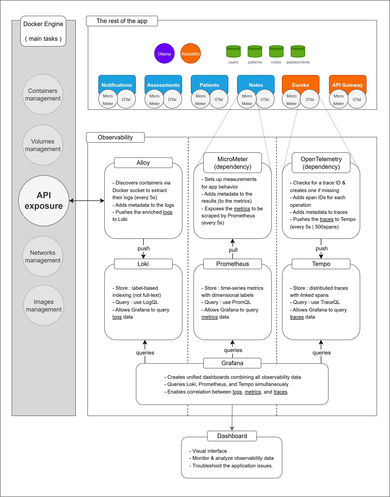

MediLabo Solutions - Diabetes risk assessment

Microservices application for diabetes risk assessment built with Spring Boot and Vue.js.

🔍 [Performance analysis](_doc/performance-analysis.md) : the main performance bottleneck was the system resource contention caused by running the app, monitoring, and load tests on the same machine - not the application itself.

📄 [Documentation & Reports](https://mr-boubakour.github.io/-BOUBAKOUR-MohamedRedha-p9-MicroServices-spring/) : includes **Javadoc** and **JaCoCo reports** for the microservices where documentation and test coverage bring the most value.

---

### 🏗️ Architecture


<details>
<summary>Architecture details (click to expand)</summary>

- **Microservices architecture**, each service owning a clear business responsibility.
- **Single page application** built with Vue.js 3, communicating securely with the API gateway.
- **Reactive API gateway** centralizes routing, authentication, and authorization. (Reactive DB)
- **Service discovery** via Eureka enables dynamic routing and scalability.
- **Synchronous** REST for standard service communication; **asynchronous** messaging via RabbitMQ for critical events.
- **Core business services**:
  - Patients service - manages patient records with relational storage.
  - Notes service - handles medical notes using a NoSQL store.
  - Assessments service - evaluates diabetes risk, detects risk level changes, and emits high-risk events.
  - Notifications service - consumes events and sends alert emails to healthcare professionals.
- **Integrated observability**: logs, metrics, and traces collected and visualized via a custom Grafana dashboard.
- **Multi-layered testing strategy**:
  - Unit and integration tests on core services.
  - End-to-end tests cover full doctor journey across services.
  - Performance testing to evaluate system behavior under load
- **CI/CD** automates testing, documentation, and image publishing.

</details>


---

### 🧰 Technology stack

| Category                             | Technologies / Tools (⚠️ on the roadmap - 🕒 Postponed)                                                                                                                                              |
|--------------------------------------|------------------------------------------------------------------------------------------------------------------------------------------------------------------------------------------------------|
| **Backend**                          | Java 21, Spring Boot 3.4.1, Spring Security, Eureka, Spring Cloud Gateway *(Reactive)*                                                                                                               |
| **Frontend**                        | Vue.js 3, Pinia, Axios                                                                                                                                                                               |
| **Data Storage**                     | MySQL, MongoDB, PostgreSQL *(Reactive)*                                                                                                                                                              |
| **Inter-service Communication**      | REST API, OpenFeign, RabbitMQ                                                                                                                                                                        |
| **Testing & Automation**             | unit        : Mockito, MockMvc<br>integration : TestContainers, MockMvc<br>e2e         : TestContainers, RestAssured, Awaitility<br> performance       : K6                                          |
| **Containerisation & Orchestration** | Docker, Docker-Compose, 🕒 *Kubernetes*                                                                                                                                                              |
| **CI/CD**                            | GitHub Actions, GitHub Pages (JaCoCo & JavaDoc), Docker Hub                                                                                                                                          |
| **Observability & Monitoring**       | logs   : Alloy, Loki, Grafana<br>metrics : Micrometer, Prometheus, Grafana<br>traces  : OpenTelemetry, Tempo, Grafana<br><br>custom dashboard : based on JVM (Micrometer) & Spring Boot obs templates |
| **Resilience & Fault Tolerance**     | ⚠️ *Resilience4J*                                                                                                                                                                                    |
| **AI Integration**                  | ⚠️ *Ollama (Llama 3.2 3B)* - Local LLM for basic diabetes risk assessment                                                                                                                            |


---

### 🔒 Security implementation


<details>
<summary>Security versions and associated Git branches (click to expand)</summary>

| Branch | Description | Status                                                                                                                           |
|--------|-------------|----------------------------------------------------------------------------------------------------------------------------------|
| `jwt-header` | JWT Access Token in Authorization header only | ✅                                                                                                                                |
| `access-header-refresh-httponly` | Access token in header + Refresh token in HttpOnly cookie | ✅                                                                                                                                |
| `all-httponly` | Full HttpOnly for Access & Refresh tokens + CSRF token | ❌ *Abandoned*<br/>Too complex for minimal security gain. Modern SPA setups with SameSite and CORS provide sufficient protection. |
| `oauth2-access&refresh` | OAuth2 with Google + classic login (Access & Refresh tokens for both) | ✅ *Current*                                                                                                                      |
| `keycloak` | Keycloak integration | 🕒 *Postponed*                                  |
</details>

---

### 📊 Observability & monitoring



>The current observability stack covers logs, metrics, and distributed traces, but does not yet include alerting for containers health or resources anomalies.   
> 
>This can be implemented later by defining alerting rules in Prometheus and managing notifications using Alertmanager.


The custom dashboard is based on the two popular dashboards : **JVM (Micrometer) & Spring Boot Observability**.

It highlights critical KPIs to ensure system health and performance:

| **KPI**                                 | **Description**                                                                                  |
|----------------------------------------|--------------------------------------------------------------------------------------------------|
| **Uptime**                              | Indicates system availability and stability over time                                            |
| **CPU usage (system and process)**      | Monitors resource consumption and detects overloads                                              |
| **Memory usage (heap and non-heap)**    | Tracks JVM memory usage to identify leaks or memory pressure                                     |
| **Request rate (requests per second)**  | Measures traffic volume handled by the service                                                   |
| **Request duration (p99, p95, p50)**    | Captures latency distributions for real user experience insights                                 |
| **Total requests and status codes**     | Tracks success and error rates (e.g. 2xx, 5xx) to monitor reliability                            |
| **Exception counts**                    | Identifies unexpected failures not reflected in HTTP status codes                                |


### 📉 Additional insights


<details>
<summary>Distributed tracing - full flow details matching the screenshot (click to expand)</summary>

| Service | Step                                                     | Description                                                                      |
| --- |----------------------------------------------------------|----------------------------------------------------------------------------------|
| Notes | Create note `(triggers reassessment)`                    | Create a note via POST /notes                                                    |
| API Gateway | Proxy requests                                           | Route requests to Assessments                                                    |
| Assessments (Feign Client) | Fetch patient and notes  `(in parallel)`                 | Fetch patient (GET /patients/{id}) and notes (GET /notes?patientId={id})         |
| Assessments | Assess risk                                              | Calculate risk via generateAssessment (trigger analysis + rules)                 |
| Assessments | Publish event                                            | If risk = "Early onset", publish high-risk-assessment event to RabbitMQ          |
| Assessments (Feign Client) | Update patient flag `(prevent sending duplicate emails)` | Update patient's earlyOnsetMailSent flag via PUT /patients/{id}/early-onset-mail |
| Notifications | Consume event and send email                             | Consume high-risk-assessment event and send alert email via Mailtrap             |

</details>

<details>
<summary>Other example - synchronous vs asynchronous feign calls for ms assessments (click to expand)</summary>

**Synchronous (Sequential – 41 ms)**

**Asynchronous (Parallel – 26 ms)**

</details>

---

### 🧪 Testing strategy

#### ✅ Unit & Integration tests

- Implemented for **Patients**, **Notes**, **Assessments** and the **Gateway**
- Covers core business logic, database operations, and Feign communication

#### ✅ End-to-End (E2E) tests

The full journey test simulates a real doctor's workflow using `DoctorJourneyE2ETest`:
- Verifies patient creation, note insertion and risk assessment logic
- Covers a 4-step risk evolution: *None → Borderline → In Danger → Early onset*
- Confirms high-risk email delivery by checking the notifications service logs
- Validates data flow across all services
- Uses **Awaitility** to ensure service readiness and propagation
- Executed in a real environment with **Docker Compose**

#### ✅ Performance tests (in progress)

Each test is launched dynamically via environment variables, enabling modular and reproducible testing with different test types and performance profiles. (using `k6` via a dedicated Docker Compose)

**Example command:**

```bash
TEST_TYPE=realistic TEST_PROFILE=load docker-compose -f docker-compose-perf-k6.yml up 
```

<details open>
<summary>📄 1. Load testing</summary>

> ### Context
>
>| **Item**             | **Description**                                                                                                                                                                                                                                                                           |
>|----------------------|-------------------------------------------------------------------------------------------------------------------------------------------------------------------------------------------------------------------------------------------------------------------------------------------|
>| Test profile         | [load] <br>- reaching up to 160 virtual users, then ramping down <br>- total time : 11 minutes<br>- thresholds: <br> &nbsp;&nbsp;&nbsp;&nbsp;&nbsp;&nbsp; - 95% of requests complete in under 2000 milliseconds <br> &nbsp;&nbsp;&nbsp;&nbsp;&nbsp;&nbsp; - less than 5% of requests fail |
>| Test type (scenario) | [realistic-traffic] <br>- login (15%)<br>- home / patients list (20%)<br>- patient record (30%)<br>- patient creation (10%)<br>- simple note creation (20%)<br>- critical note creation (5%)                                                                                              |
>| Goal                 | Measure Gateway performance under a realistic load, simulating <u>a number and pace of users close to a normal usage</u>, with and without monitoring.                                                                                                                                    |
>| Date                 | [30-07-2025]                                                                                                                                                                                                                                                                              |
>
>
> ### Key Results
>
>| KPI                            | Without the observability stack | With the observability stack |
>|--------------------------------|---------------------------------|------------------------------|
>| Avg response time              | 20.8 ms                         | 27.57 ms                     |
>| 50th percentile (p50 / median) | 11.39 ms                        | 15.34 ms                     |
>| 95th percentile (p95)          | 82.12 ms ✅                      | 101.51 ms ✅                  |
>| Error rate                     | 0.00% ✅                         | 0.00% ✅                      |
>| Exception counts               | 0                               | 0                            |
>| Request rate                   | 74.63 req/s                     | 74.40 req/s                  |
>| Total requests                 | 51,641                          | 51,786                       |
>
> ### Dashboard Overview
>
> 

</details>

<details>
<summary>📄 2. Stress testing</summary>

> ### Context
>
> | **Item**             | **Description**                                                                                                                                                                                                                                                                              |
> |----------------------|----------------------------------------------------------------------------------------------------------------------------------------------------------------------------------------------------------------------------------------------------------------------------------------------|
> | Test profile         | [stress] <br>- reaching up to 400 virtual users, then ramping down <br>- total time: 11 minutes <br>- thresholds: <br> &nbsp;&nbsp;&nbsp;&nbsp;&nbsp;&nbsp; - 95% of requests complete in under 8000 milliseconds <br> &nbsp;&nbsp;&nbsp;&nbsp;&nbsp;&nbsp; - less than 20% of requests fail |
> | Test type (scenario) | [realistic-traffic] <br>- login (15%)<br>- home / patients list (20%)<br>- patient record (30%)<br>- patient creation (10%)<br>- simple note creation (20%)<br>- critical note creation (5%)                                                                                                 |
> | Goal                 | Assess Gateway stability and performance limits under <u>increasing load, pushing beyond normal usage</u>, with and without the observability stack.                                                                                                                                         |
> | Date                 | [30-07-2025]                                                                                                                                                                                                                                                                                 |
>
> ### Key Results
>
>| KPI                            | Without the observability stack | With the observability stack |
>|--------------------------------|---------------------------------|------------------------------|
>| Avg response time              | 190.64 ms                       | [X] ms                       |
>| 50th percentile (p50 / median) | 22.4 ms                         | [X] ms                       |
>| 95th percentile (p95)          | 1.19 s ✅                        | [X] ms                       |
>| Error rate                     | 0.0038% (4) ✅                   | [X]%                         |
>| Exception counts               | 0                               | [X]                          |
>| Request rate                   | 153.35 req/s                    | [X] req/s                    |
>| Total requests                 | 106,301                         | [X]                          |
>
>
> ### Dashboard Overview
> 
> 

</details>

<details>
<summary>📄 3. Spike testing</summary>

> ### Context
>
> | **Item**             | **Description**                                                                                                                                                                                                                                                                                                 |
> |----------------------|-----------------------------------------------------------------------------------------------------------------------------------------------------------------------------------------------------------------------------------------------------------------------------------------------------------------|
> | Test profile         | [spike] <br>- sudden jump to 400 virtual users, short bursts, then quick ramp down <br>- total time: ~6.5 minutes <br>- thresholds: <br> &nbsp;&nbsp;&nbsp;&nbsp;&nbsp;&nbsp; - 95% of requests complete in under 10000 milliseconds <br> &nbsp;&nbsp;&nbsp;&nbsp;&nbsp;&nbsp; - less than 30% of requests fail |
> | Test type (scenario) | [realistic-traffic] <br>- login (15%)<br>- home / patients list (20%)<br>- patient record (30%)<br>- patient creation (10%)<br>- simple note creation (20%)<br>- critical note creation (5%)                                                                                                                    |
> | Goal                 | Evaluate Gateway’s capacity to handle <u>sudden traffic spikes</u> and recovery behavior, with and without the observability stack.                                                                                                                                                                             |
> | Date                 | [30-07-2025]                                                                                                                                                                                                                                                                                                    |
>
> ### Key Results
>
>| KPI                            | Without the observability stack | With the observability stack |
>|--------------------------------|---------------------------------|------------------------------|
>| Avg response time              | 37.46 ms                        | [X] ms                       |
>| 50th percentile (p50 / median) | 14.15 ms                        | [X] ms                       |
>| 95th percentile (p95)          | 153.28 ms ✅                     | [X] ms                       |
>| Error rate                     | 0.00% ✅                         | [X]%                         |
>| Exception counts               | 0                               | [X]                          |
>| Request rate                   | 78.95 req/s                     | [X] req/s                    |
>| Total requests                 | 32,425                          | [X]                          |
>
>
> ### Dashboard Overview
>
> 

</details>

<details>
<summary>📄 4. Soak testing</summary>

> ### Context
>
> | **Item**             | **Description**                                                                                                                                                                                                                                                                            |
> |----------------------|--------------------------------------------------------------------------------------------------------------------------------------------------------------------------------------------------------------------------------------------------------------------------------------------|
> | Test profile         | [soak] <br>- steady load of 40 virtual, ramp up and down included <br>- total time: 64 minutes <br>- thresholds: <br> &nbsp;&nbsp;&nbsp;&nbsp;&nbsp;&nbsp; - 95% of requests complete in under 3000 milliseconds <br> &nbsp;&nbsp;&nbsp;&nbsp;&nbsp;&nbsp; - less than 5% of requests fail | 
> | Test type (scenario) | [realistic-traffic] <br>- login (15%)<br>- home / patients list (20%)<br>- patient record (30%)<br>- patient creation (10%)<br>- simple note creation (20%)<br>- critical note creation (5%)                                                                                               |
> | Goal                 | Verify Gateway stability and <u>resource usage under sustained load over an extended period</u>, with and without the observability stack.                                                                                                                                                 |
> | Date                 | [30-07-2025]                                                                                                                                                                                                                                                                               |
>
> ### Key Results
>
>| KPI                            | Without the observability stack | With the observability stack |
>|--------------------------------|---------------------------------|------------------------------|
>| Avg response time              | 21.91 ms                        | [X] ms                       |
>| 50th percentile (p50 / median) | 13.63 ms                        | [X] ms                       |
>| 95th percentile (p95)          | 73.55 ms ✅                      | [X] ms                       |
>| Error rate                     | 0.00% ✅                         | [X]%                         |
>| Exception counts               | 0                               | [X]                          |
>| Request rate                   | 29.17 req/s                     | [X] req/s                    |
>| Total requests                 | 117,966                         | [X]                          |
>
> ### Dashboard Overview
>
> 

</details>

- A full analysis was conducted to understand the system's saturation behavior.  
  👉 [Read the full performance analysis](_doc/performance-analysis.md)

---

### 🔔 Event-driven

The system implements asynchronous communication using **RabbitMQ** for critical notifications:

- **High-Risk assessment events** - when a patient is assessed as `"Early onset"`, the **Assessments** service publishes an event to the `high-risk-assessments` queue
- **No duplicates** - the alert is triggered only when the risk changes to `"Early onset"`
- **Email notifications** - the **Notifications** service consumes these events and sends automated email alerts to healthcare providers (emails are intercepted using **Mailtrap** during development)

---

### 🚀 CI/CD pipelines

- `push_dev_ci.yml` - runs unit tests on modified microservices when pushing to `dev`
- `pr_main_ci-cd.yml` - builds, tests, generates JaCoCo & JavaDocs, deploys docs to GitHub Pages (on PR to `main`)
- `merge_main_cd.yml` - pushes Docker images to Docker Hub after PR is merged into `main`

---

### ❌ Out of scope

- **Spring Cloud Config Server** - no centralized configuration management. *(used in a different project, with RabbitMQ as the refresh trigger and a GitHub repository for versioning and storing configurations)*
- **Secrets manager** - secrets are managed via environment variables.
- **Front-end testing**  - deprioritized to focus efforts on back-end reliability and service integration.