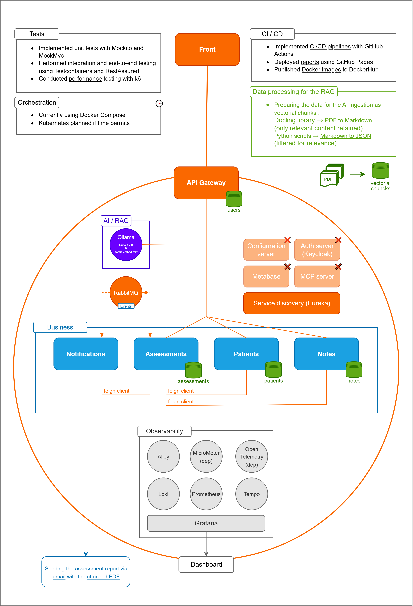
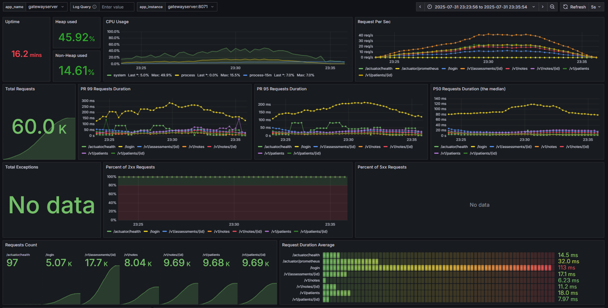

MediLabo Solutions - the AI medical assistant for diabetes risk assessment

Microservices application built with Spring Boot and Vue.js.

📄 [Documentation & Reports](https://mr-boubakour.github.io/-BOUBAKOUR-MohamedRedha-p9-MicroServices-spring/) : includes **Javadoc** and **JaCoCo reports** for the microservices where documentation and test coverage bring the most value.

---

### 🧰 Technology stack

| Category                             | Technologies / Tools (🕒 Postponed)                                                                                                                                                                   |
|--------------------------------------|-------------------------------------------------------------------------------------------------------------------------------------------------------------------------------------------------------|
| **Backend**                          | Java 21<br>Spring Boot 3.4.1 (web, security, data, cloud, actuator, etc.)<br>Spring Cloud Gateway (Reactive)<br>Eureka                                                                                |
| **Frontend**                         | Vue.js 3<br>Pinia<br>Axios                                                                                                                                                                            |
| **Data Storage**                     | MySQL<br>MongoDB<br>PostgreSQL (reactive)<br>PostgreSQL (with vector extension, for the RAG)                                                                                                          |
| **Communication**            | REST API<br>OpenFeign<br>RabbitMQ<br>SSE (Server-Sent Events)                                                                                                                                          |
| **Testing & Automation**             | unit        : Mockito, MockMvc<br>integration : TestContainers, MockMvc<br>e2e         : TestContainers, RestAssured, Awaitility<br> performance       : K6                                           |
| **Containerisation & Orchestration** | Docker<br>Docker-Compose<br>🕒 Kubernetes                                                                                                                                                             |
| **CI/CD**                            | GitHub Actions<br>GitHub Pages (JaCoCo & JavaDoc)<br>Docker Hub                                                                                                                                       |
| **Observability & Monitoring**       | logs   : Alloy, Loki, Grafana<br>metrics : Micrometer, Prometheus, Grafana<br>traces  : OpenTelemetry, Tempo, Grafana<br><br>custom dashboard : based on JVM (Micrometer) & Spring Boot obs templates |
| **Resilience & Fault Tolerance**     | 🕒 Resilience4J                                                                                                                                                                                       |
| **AI Integration**                   | Ollama (Llama 3.2 3B & nomic-embed-text)                                                                                                                                                              |


---

### 🏗️ Architecture



- **Microservices architecture**, each service own a clear business responsibility.
- **Single page application** built with Vue.js 3.
- **Reactive API gateway** centralizes routing, authentication, and authorization. (Reactive PostgresQL DB)
- **Service discovery via Eureka** enables dynamic routing and scalability.
- **Communication**
  - REST & FeignClient.
  - RabbitMQ - for critical events.
  - SSE (Server-Sent Events) - streams in real-time the AI assessment progress to the frontend
- **Core business services**:
  - Patients service - manages patient records (Mysql DB).
  - Notes service - handles medical notes (Mongo DB).
  - Assessments service – uses the local AI to produce a structured assessment for review and validation by the doctor
  - Notifications service – when an assessment is validated by the doctor, an email is sent with the PDF assessment attached
- **Local AI** – summarizes relevant chunks and generates the structured assessment
- **Observability**: logs, metrics, and traces collected and visualized via a custom Grafana dashboard.
- **Multi-layered testing strategy**:
  - Unit and integration tests on core services.
  - End-to-end tests cover full doctor journey across services.
  - Performance testing to evaluate system behavior under load
- **CI/CD** automates testing, documentation, and image publishing.

---

### 📈 Business flow


---

### 🔒 Security implementation


<details>
<summary>Security versions and associated Git branches (click to expand)</summary>

| Branch | Description | Status                                                                                                                           |
|--------|-------------|----------------------------------------------------------------------------------------------------------------------------------|
| `jwt-header` | JWT Access Token in Authorization header only | ✅                                                                                                                                |
| `access-header-refresh-httponly` | Access token in header + Refresh token in HttpOnly cookie | ✅                                                                                                                                |
| `all-httponly` | Full HttpOnly for Access & Refresh tokens + CSRF token | ❌ *Abandoned*<br/>Too complex for minimal security gain. Modern SPA setups with SameSite and CORS provide sufficient protection. |
| `oauth2-access&refresh` | OAuth2 with Google + classic login (Access & Refresh tokens for both) | ✅ *Current*                                                                                                                      |
| `keycloak` | Keycloak integration | 🕒 *Postponed*                                  |
</details>

---

### 🔔 Event-driven


The system implements asynchronous communication using RabbitMQ for critical events:

- **AiAssessmentProcessEvent** – published by the Assessments service when a new AI assessment is queued for processing.
  - The queue is configured to handle events **one by one** (concurrency = 1) to avoid overloading the local AI when many assessments are requested simultaneously.
  - Consumed by `AiAssessmentProcessListener`, which triggers the AI pipeline.

- **AssessmentReportReadyEvent** – published by the Assessments service when an assessment has been validated by the doctor and is ready to be sent.
  - Consumed by `the Notifications service`, which triggers the sending of an email with the PDF assessment attached.

> **Note concerning the SSE (Server-Sent Events)** - streams real-time assessment progress directly to the frontend while the AI generates the structured assessment.

---

### 🔄 Data processing


---

### 🧠 IA workflow — Assessments service


- **Input**
  - Patient's medical record

- **Guidelines Preparation** (the data process presented in the previous section)
  - Convert the guidelines document into JSON with chunks + metadata (guidelines chunks)
  - Extract references into a JSON file (medical references/sources)
  - Embed the chunks using Nomic embed text
  - Index the vectors + metadata into the vector database

- **Patient Record Vectorization**
  - Embed the patient's medical record using Nomic embed text
  - Retrieve the Top-5 most relevant chunks from the vector database

- **Summarization**
  - Generate a contextual summary based on the retrieved chunks

- **Final Diagnosis**
  - Inputs: summary + patient's medical record
  - Structured output:
    - Risk level (VERY_LOW, LOW, MODERATE, HIGH)
    - Context summary
    - Medical analysis (diagnosis)
    - Recommendations
    - Sources (retrieved from the guidelines JSON references)

---

### 📊 Observability & monitoring


>The current observability stack covers logs, metrics, and distributed traces, but does not yet include alerting for containers health or resources anomalies.   
> 
>This can be implemented later by defining alerting rules in Prometheus and managing notifications using Alertmanager.


The custom dashboard is based on the two popular dashboards : **JVM (Micrometer) & Spring Boot Observability**.

It highlights critical KPIs to ensure system health and performance:

| **KPI**                                 | **Description**                                                                                  |
|----------------------------------------|--------------------------------------------------------------------------------------------------|
| **Uptime**                              | Indicates system availability and stability over time                                            |
| **CPU usage (system and process)**      | Monitors resource consumption and detects overloads                                              |
| **Memory usage (heap and non-heap)**    | Tracks JVM memory usage to identify leaks or memory pressure                                     |
| **Request rate (requests per second)**  | Measures traffic volume handled by the service                                                   |
| **Request duration (p99, p95, p50)**    | Captures latency distributions for real user experience insights                                 |
| **Total requests and status codes**     | Tracks success and error rates (e.g. 2xx, 5xx) to monitor reliability                            |
| **Exception counts**                    | Identifies unexpected failures not reflected in HTTP status codes                                |


### 📉 Additional insights


<details>
<summary>Distributed tracing - full flow details matching the screenshot (click to expand)</summary>

| Service | Step                                                     | Description                                                                      |
| --- |----------------------------------------------------------|----------------------------------------------------------------------------------|
| Notes | Create note `(triggers reassessment)`                    | Create a note via POST /notes                                                    |
| API Gateway | Proxy requests                                           | Route requests to Assessments                                                    |
| Assessments (Feign Client) | Fetch patient and notes  `(in parallel)`                 | Fetch patient (GET /patients/{id}) and notes (GET /notes?patientId={id})         |
| Assessments | Assess risk                                              | Calculate risk via generateAssessment (trigger analysis + rules)                 |
| Assessments | Publish event                                            | If risk = "Early onset", publish high-risk-assessment event to RabbitMQ          |
| Assessments (Feign Client) | Update patient flag `(prevent sending duplicate emails)` | Update patient's earlyOnsetMailSent flag via PUT /patients/{id}/early-onset-mail |
| Notifications | Consume event and send email                             | Consume high-risk-assessment event and send alert email via Mailtrap             |

</details>

<details>
<summary>Other example - synchronous vs asynchronous feign calls for ms assessments (click to expand)</summary>

**Synchronous (Sequential – 41 ms)**

**Asynchronous (Parallel – 26 ms)**

</details>

---

### 🧪 Testing strategy

#### ✅ Unit & Integration tests

- Implemented for **Patients**, **Notes**, **Assessments** and the **Gateway**
- Covers core business logic, database operations, and Feign communication

#### ✅ End-to-End (E2E) tests

The full journey test simulates a real doctor's workflow using `DoctorJourneyE2ETest`:
- Verifies patient creation, note insertion and risk assessment logic
- Covers a 4-step risk evolution: *None → Borderline → In Danger → Early onset*
- Confirms high-risk email delivery by checking the notifications service logs
- Validates data flow across all services
- Uses **Awaitility** to ensure service readiness and propagation
- Executed in a real environment with **Docker Compose**

#### ✅ Performance tests (in progress)

Each test is launched dynamically via environment variables, enabling modular and reproducible testing with different test types and performance profiles. (using `k6` via a dedicated Docker Compose)

**Example command:**

```bash
TEST_TYPE=realistic TEST_PROFILE=load docker-compose -f docker-compose/docker-compose-perf-k6.yml up
```

<details open>
<summary>📄 1. Load testing</summary>

> ### Context
>
>| **Item**             | **Description**                                                                                                                                                                                                                                                                           |
>|----------------------|-------------------------------------------------------------------------------------------------------------------------------------------------------------------------------------------------------------------------------------------------------------------------------------------|
>| Test profile         | [load] <br>- reaching up to 160 virtual users, then ramping down <br>- total time : 11 minutes<br>- thresholds: <br> &nbsp;&nbsp;&nbsp;&nbsp;&nbsp;&nbsp; - 95% of requests complete in under 2000 milliseconds <br> &nbsp;&nbsp;&nbsp;&nbsp;&nbsp;&nbsp; - less than 5% of requests fail |
>| Test type (scenario) | [realistic-traffic] <br>- login (15%)<br>- home / patients list (20%)<br>- patient record (30%)<br>- patient creation (10%)<br>- simple note creation (20%)<br>- critical note creation (5%)                                                                                              |
>| Goal                 | Measure Gateway performance under a realistic load, simulating <u>a number and pace of users close to a normal usage</u>, with and without monitoring.                                                                                                                                    |
>| Date                 | [01-08-2025]                                                                                                                                                                                                                                                                              |
>
> ### Key Results
>
> | KPI                            | Without the observability stack | With the observability stack |  
> |--------------------------------|---------------------------------|------------------------------|  
> | Avg response time              | 20.33 ms                        | 23.04 ms                     |  
> | 50th percentile (p50 / median) | 11.81 ms                        | 13.31 ms                     |  
> | 95th percentile (p95)          | 83.05 ms ✅                      | 90.07 ms ✅                   |  
> | Error rate                     | 0.00% ✅                         | 0.00% ✅                      |  
> | Exception counts               | N/A                             | 0                            |  
> | Request rate                   | 87.13 req/s                     | 86.71 req/s                  |  
> | Total requests                 | 59731                           | 59539                        |
> 
> ### Dashboard Overview
>
> 

</details>

<details>
<summary>📄 2. Stress testing (click to expand)</summary>

> ### Context
>
> | **Item**             | **Description**                                                                                                                                                                                                                                                                              |
> |----------------------|----------------------------------------------------------------------------------------------------------------------------------------------------------------------------------------------------------------------------------------------------------------------------------------------|
> | Test profile         | [stress] <br>- reaching up to 400 virtual users, then ramping down <br>- total time: 11 minutes <br>- thresholds: <br> &nbsp;&nbsp;&nbsp;&nbsp;&nbsp;&nbsp; - 95% of requests complete in under 8000 milliseconds <br> &nbsp;&nbsp;&nbsp;&nbsp;&nbsp;&nbsp; - less than 20% of requests fail |
> | Test type (scenario) | [realistic-traffic] <br>- login (15%)<br>- home / patients list (20%)<br>- patient record (30%)<br>- patient creation (10%)<br>- simple note creation (20%)<br>- critical note creation (5%)                                                                                                 |
> | Goal                 | Assess Gateway stability and performance limits under <u>increasing load, pushing beyond normal usage</u>, with and without the observability stack.                                                                                                                                         |
> | Date                 | [01-08-2025]                                                                                                                                                                                                                                                                                 |
>
> ### Key Results
>
> | KPI                            | Without the observability stack | With the observability stack |  
> |--------------------------------|---------------------------------|------------------------------|  
> | Avg response time              | 272.81 ms                       | 321.09 ms                    |  
> | 50th percentile (p50 / median) | 36.87 ms                        | 57.10 ms                     |  
> | 95th percentile (p95)          | 1.45 s ✅                        | 1.49 s ✅                     |  
> | Error rate                     | 0.03% (38) ✅                    | 0.04% (52) ✅                 |  
> | Exception counts               | N/A                             | 64                           |  
> | Request rate                   | 160.25 req/s                    | 154.39 req/s                 |  
> | Total requests                 | 110418                          | 106979                       |
> 
> 
> ### Dashboard Overview
> 
> 

</details>

<details>
<summary>📄 3. Spike testing (click to expand)</summary>

> ### Context
>
> | **Item**             | **Description**                                                                                                                                                                                                                                                                                                 |
> |----------------------|-----------------------------------------------------------------------------------------------------------------------------------------------------------------------------------------------------------------------------------------------------------------------------------------------------------------|
> | Test profile         | [spike] <br>- sudden jump to 400 virtual users, short bursts, then quick ramp down <br>- total time: ~6.5 minutes <br>- thresholds: <br> &nbsp;&nbsp;&nbsp;&nbsp;&nbsp;&nbsp; - 95% of requests complete in under 10000 milliseconds <br> &nbsp;&nbsp;&nbsp;&nbsp;&nbsp;&nbsp; - less than 30% of requests fail |
> | Test type (scenario) | [realistic-traffic] <br>- login (15%)<br>- home / patients list (20%)<br>- patient record (30%)<br>- patient creation (10%)<br>- simple note creation (20%)<br>- critical note creation (5%)                                                                                                                    |
> | Goal                 | Evaluate Gateway’s capacity to handle <u>sudden traffic spikes</u> and recovery behavior, with and without the observability stack.                                                                                                                                                                             |
> | Date                 | [01-08-2025]                                                                                                                                                                                                                                                                                                    |
>
> ### Key Results
>
> | KPI                            | Without the observability stack | With the observability stack |  
> |--------------------------------|---------------------------------|------------------------------|  
> | Avg response time              | 54.85 ms                        | 92.49 ms                     |  
> | 50th percentile (p50 / median) | 14.89 ms                        | 18.46 ms                     |  
> | 95th percentile (p95)          | 214.34 ms ✅                     | 377.03 ms ✅                  |  
> | Error rate                     | 0.00% ✅                         | 0.00% ✅                      |  
> | Exception counts               | N/A                             | 0                            |  
> | Request rate                   | 90.19 req/s                     | 87.15 req/s                  |  
> | Total requests                 | 36986                           | 35803                        |
>
> ### Dashboard Overview
>
> 

</details>

<details>
<summary>📄 4. Soak testing (click to expand)</summary>

> ### Context
>
> | **Item**             | **Description**                                                                                                                                                                                                                                                                            |
> |----------------------|--------------------------------------------------------------------------------------------------------------------------------------------------------------------------------------------------------------------------------------------------------------------------------------------|
> | Test profile         | [soak] <br>- steady load of 40 virtual, ramp up and down included <br>- total time: 64 minutes <br>- thresholds: <br> &nbsp;&nbsp;&nbsp;&nbsp;&nbsp;&nbsp; - 95% of requests complete in under 3000 milliseconds <br> &nbsp;&nbsp;&nbsp;&nbsp;&nbsp;&nbsp; - less than 5% of requests fail | 
> | Test type (scenario) | [realistic-traffic] <br>- login (15%)<br>- home / patients list (20%)<br>- patient record (30%)<br>- patient creation (10%)<br>- simple note creation (20%)<br>- critical note creation (5%)                                                                                               |
> | Goal                 | Verify Gateway stability and <u>resource usage under sustained load over an extended period</u>, with and without the observability stack.                                                                                                                                                 |
> | Date                 | [01-08-2025]                                                                                                                                                                                                                                                                               |
>
> ### Key Results
>
> | KPI                            | Without the observability stack | With the observability stack |  
> |--------------------------------|---------------------------------|------------------------------|  
> | Avg response time              | 21.69 ms                        | 21.27 ms                     |  
> | 50th percentile (p50 / median) | 13.96 ms                        | 14.33 ms                     |  
> | 95th percentile (p95)          | 73.86 ms ✅                      | 78.57 ms ✅                   |  
> | Error rate                     | 0.00% ✅                         | 0.00% ✅                      |  
> | Exception counts               | N/A                             | 0                            |  
> | Request rate                   | 33.64 req/s                     | 36.37 req/s                  |  
> | Total requests                 | 135616                          | 135010                       |
>
> ### Dashboard Overview
>
> 

</details>

<br>

#### ✅ Systematic analysis outlining performance constraints and testing methodology

the main performance bottleneck was the system resource contention caused by running the app, monitoring, and load tests on the same machine - not the application itself.

👉 [Read the full performance analysis](_doc/performance-analysis.md)

---

### 🚀 CI/CD pipelines

- `push_dev_ci.yml` - runs unit tests on modified microservices when pushing to `dev`
- `pr_main_ci-cd.yml` - builds, tests, generates JaCoCo & JavaDocs, deploys docs to GitHub Pages (on PR to `main`)
- `merge_main_cd.yml` - pushes Docker images to Docker Hub after PR is merged into `main`

---

### ❌ Out of scope

Potential improvements and extensions for the project if additional time and resources were available:

- **Centralized Configuration** – implement Spring Cloud Config Server for centralized configuration management. *(Used in a different project, with RabbitMQ as the refresh trigger and a GitHub repository for versioning and storing configurations.)*

- **Secrets Management** – integrate a dedicated secrets manager for secure handling of credentials.

- **Front-end Testing** – expand coverage to include end-to-end UI tests.

- **Identity & Access Management** – integrate Keycloak for centralized authentication and authorization.

- **Container Orchestration** – deploy and manage services on Kubernetes for scalability and reliability.

- **Advanced Monitoring & Alerting** – add advanced monitoring and alerting for AI processing pipeline and SSE streams.

- **Business Dashboard** – integrate Metabase for business analytics and reporting.

- **Model-Context-Protocol (MCP)** – implement as a dedicated microservice that allows the AI to autonomously access external tools, services, and data sources, standardizing interactions and improving integration and interoperability.