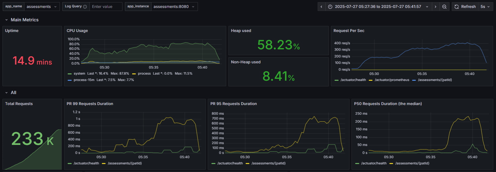

# Performance analysis

## 🧪 Performance test scope and limitations

These performance tests were conducted under the following conditions:

- Simulated access to a random patient record based on a patient ID generated by the tests (for the Gateway).
- Direct targeting of the endpoint triggering an assessment for the target patient, bypassing the Gateway by exposing the Assessment microservice externally.
- Direct targeting of the endpoint retrieving data for the target patient, bypassing the Gateway by exposing the Patients microservice externally.

**Notably, these tests did not include:**

- Patient creation or note creation operations.
- Triggering of events by assessments that would be captured by RabbitMQ and forwarded to the Notifications microservice.

The goal of this exercise was primarily to isolate and understand the root cause of the bottleneck. More comprehensive (“global”) test scripts will be created if time permits.

> If you have feedback, ideas, or a different interpretation of the results, I would be genuinely grateful to hear it. I approach this analysis as a learning opportunity and would greatly appreciate any expert insights that could improve my investigation or methodology.

---

## 📍 Initial symptom

- **Problem**: performance degradation beyond specific load threshold
- **Observation**: Gateway + individual services performing well, but system saturated
- **Intuition**: reactive Spring Cloud Gateway as bottleneck

---

# 🚪 Initial hypothesis: Gateway bottleneck

### Gateway optimization attempt

- **Netty configuration optimization (pools, threads)**: no substantial improvement
- **token caching + log level change everywhere (`DEBUG` → `INFO`)**: meaningful improvement but the same observed ceiling

### Investigating beyond the Gateway: isolated service testing

- **Approach**: test each microservice individually, including their own downstream calls
- **Observation**: each component - Gateway, Assessment, and Patients microservices - independently reaches 100% CPU under load
- **Key discovery**: performance issues persist even when bypassing the Gateway

### Investigating beyond the application: observability impact analysis

- **Observation**: significant impact on the results when testing with and without the observability stack

### Test configuration

```yaml
load: {
    stages: [
        { duration: '1m', target: 150 },
        { duration: '3m', target: 150 },
        { duration: '1m', target: 300 },
        { duration: '3m', target: 300 },
        { duration: "1m", target: 450 },
        { duration: '3m', target: 450 },
        { duration: '1m', target: 0 },
    ],
    thresholds: {
        http_req_duration: ['p(95)<2000'],
        http_req_failed: ['rate<0.05']
    }
}
```

### Load equivalence analysis:

> This rough comparison aims to estimate how much load each service generates, based on how many backend calls are made per virtual user. It’s not exact, but it gives a useful sense of the relative impact between services with different request paths.

| Target      | Backend calls per VU | Equivalent load    |
|-------------|----------------------|--------------------|
| Gateway     | 5                    | 450 VUs (baseline) |
| Assessments | 3                    | 1000 VUs           |
| Patients    | 1                    | 3000 VUs           |

# 📊 Results

### Gateway (max 450 VUs, 13 min test)

| 📌 Gateway metrics      | Without observability stack | With observability stack |
|-------------------------|-----------------------------|--------------------------|
| http_req_duration (avg) | 69.73 ms                    | 813.02 ms                |
| http_req_duration (p90) | 138.73 ms                   | 2.13 s                   |
| http_req_duration (p95) | 228.97 ms ✅                 | 2.73 s 🚨                |
| http_reqs (per second)  | 373.23 req/s                | 254.61 req/s             |
| http_req_failed         | 0.00% (0/311,584)           | 0.04% (101/209,581)      |
| Completed iterations    | 103,861                     | 69,860                   |


### Assessments service (max 1000 VUs, 13 min test)

| 📌 Assessments metrics  | Without observability stack | With observability stack |
|-------------------------|-----------------------------|--------------------------|
| http_req_duration (avg) | 60.15 ms                    | 183.58 ms                |
| http_req_duration (p90) | 123.36 ms                   | 502.13 ms                |
| http_req_duration (p95) | 237.7 ms ✅                  | 740.57 ms ✅              |
| http_reqs (per second)  | 296.72 req/s                | 279.10 req/s             |
| http_req_failed         | 0.00%                       | 0.00%                    |
| Completed iterations    | 245,715                     | 231,568                  |



### Patients service (max 3000 VUs, 13 min test)

| 📌 Patients metrics     | Without observability stack | With observability stack |
|-------------------------|-----------------------------|--------------------------|
| http_req_duration (avg) | 45.14 ms                    | 244.56 ms                |
| http_req_duration (p90) | 124.34 ms                   | 740.16 ms                |
| http_req_duration (p95) | 269.37 ms ✅                 | 941 ms ✅                 |
| http_reqs (per second)  | 854.57 req/s                | 777.51 req/s             |
| http_req_failed         | 0.00% (0/703,709)           | 0.00% (0/642,708)        |
| Completed iterations    | 703,708                     | 642,707                  |


---

# Root cause analysis

## 🎯 Identification

**Primary bottleneck**: system resource overload, not application or code issues.
The performance drop happens because the application, observability stack and load testing tool run together on the same machine, causing competition for hardware resources.

## 📋 Supporting evidence

### Resource utilization

- Target services CPU usage: maximum of 15–20%
- Downstream services CPU usage: <5% each
- Total application CPU consumption: 30–40%
- System CPU utilization: consistently 100%

### Performance with vs. without observability stack

- **Without observability stack**: all services meet performance thresholds (p95 < 2s)
- **With observability stack**: significant degradation across all metrics

---

## 💡 Key conclusions

- Microservices architecture is sound : individual services demonstrate excellent performance characteristics
- Observability (& load testing) overhead is significant
- Infrastructure separation is critical : co-location of application, load testing, and the observability stack creates resource contention